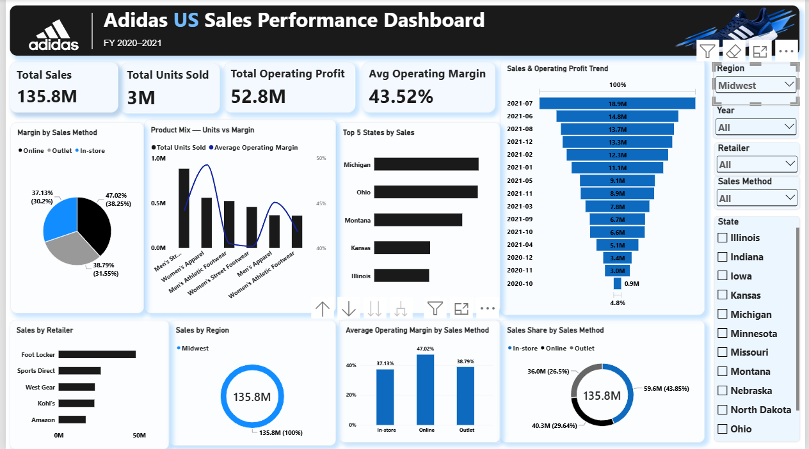

# Adidas US Sales Performance Dashboard

An interactive Power BI dashboard analyzing Adidas US sales for FY 2020-2021.

## Dashboard Preview

## Key Metrics
- Total Sales, Units Sold, Operating Profit, Average Operating Margin

## Features
- Sales and operating profit trend over time
- Product mix: units sold vs margin
- Top 5 states and retailers by sales
- Margin and sales share by sales method (Online, Outlet, In-store)
- Filters: Region, Year, Retailer, Sales Method, State

## Tools
Power BI, DAX, Data Modeling

## How to Use
1. Download `Adidas_US_Sales_Dashboard.pbix`
2. Open it in Power BI Desktop
3. Use the slicers to explore the data
